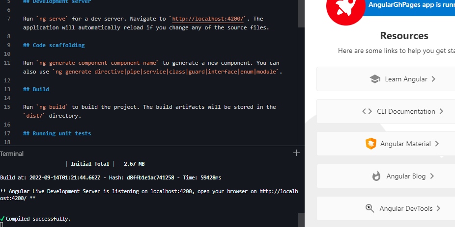
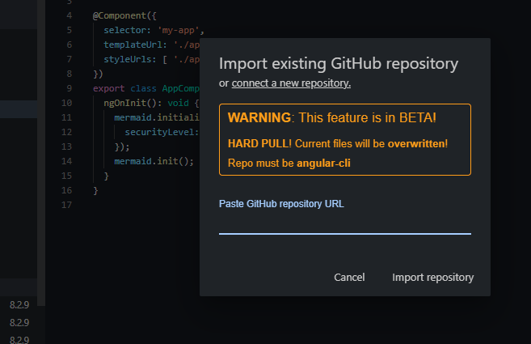
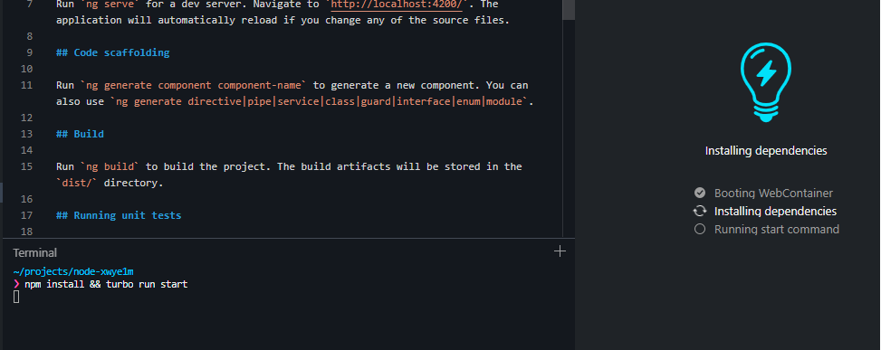
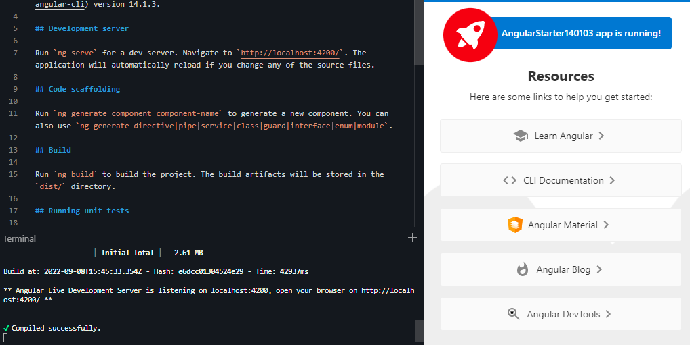

## 1. Prepare Git Environment
# open the Browser Create a new Repo in https://github.com/ after creating an account

```powershell
git config --global user.email "gmanoj.isaac@gmail.com"
git config --global user.name "Manoj"
```

## 2. Add new Github Repo
# To remove a commit from the github location

```powershell
git stash
git pull
git reset --hard HEAD~1
git push origin HEAD --force

```

# Go to the new angular project and add repo to the angular project
```powershell
git remote remove origin
git remote add origin https://github.com/gmanojisaac/AngularStorybook.git
git remote -v show
git status
git log --oneline
git add .
git commit -am “Material & ngx-markdown working”
git push -u origin master

```

## 3. Host static pages in gh-pages
Change the asset access link to ./assets and create a new branch for it
```typescript
(out)  npm install gh-pages --save-dev
```

# open the package.json file and add the following code at the beginning of the file.
```typescript
(out) "homepage": "http://github.com/gmanojisaac/AngularGithub.git",
(out)
(out) storybook-static is a build file that will be generated after building your Storybook locally.
(out)
(out)"scripts": {
(out)    "predeploy": "npm run build-storybook",
(out)    "deploy-storybook": "gh-pages -d storybook-static",
(out)
(out) npm run predeploy
(out) npm run deploy-storybook
```
# Git Commands

```typescript
(out) git checkout -b Storybookdeploy
(out) git add .
(out) git commit -am "Added storybook static file"
(out) git push -u origin Storybookdeploy
```

## 4. Prepare Stackblitz Environment
# Add file .stackblitzrc in project folder, push master brnnch to origin repo

```typescript
(out)  {"installDependencies":true,"startCommand":"turbo run serve","env":{"ENABLE_CJS_IMPORTS":true}}
```
# open the Browser Create a new nodeJs project in https://stackblitz.com/ after creating an account
# Go to the new angular project and master branch



## 5. Prepare for Storybook Branch

# Create a New Branch for stackblitz deployment -> storybook
```powershell
 npm install -g npx
 npx -p @storybook/cli sb init --type angular
```

# Modify  file .stackblitzrc

```typescript
(out)  {"installDependencies":true,"startCommand":"turbo run storybook","env":{"ENABLE_CJS_IMPORTS":true}}
```

# Git Commands

```typescript
(out) git checkout -b Storybook
(out) git add .
(out) git commit -am "Added storybook"
(out) git push -u origin Storybook
```

## 6. Prepare & Run in stackblitz Environment
# Create a new NodeJs project and add the repo with master branch



#
# Load the master branch and install and serve



#
# Open the browser and the run the application from the cloud



#
# Change the branch to storybook and dicard the changes. Change the command to npm install && turbo run storybook


# Wait for the stackblitz compilation and load the application in a new window.

