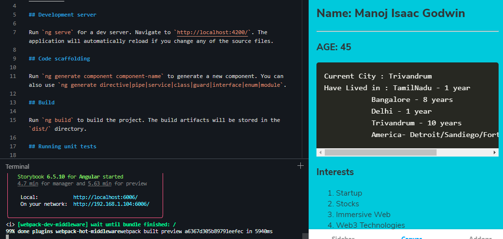

## 0. Download the latest stackblitz env from angular.io
# UnZip the file and install packages.

```powershell
(out) https://angular.io/generated/live-examples/getting-started-v0/stackblitz.html
```
## 1. Prepare Git Environment
# open the Browser Create a new Repo in https://github.com/ after creating an account

```powershell
git config --global user.email "gmanoj.isaac@gmail.com"
git config --global user.name "gmanojisaac"
```

## 2. Add new Github Repo
# To remove a commit from the github location

```powershell
git stash
git pull
git reset --hard HEAD~1
git push origin HEAD --force

```

# Initialize the git (git init) and create the .gitignore file in the root of the project

```typescript
# See http://help.github.com/ignore-files/ for more about ignoring files.

# Compiled output
/dist
/tmp
/out-tsc
/bazel-out

# Node
/node_modules
npm-debug.log
yarn-error.log

# IDEs and editors
.idea/
.project
.classpath
.c9/
*.launch
.settings/
*.sublime-workspace

# Visual Studio Code
.vscode/*
!.vscode/settings.json
!.vscode/tasks.json
!.vscode/launch.json
!.vscode/extensions.json
.history/*

# Miscellaneous
/.angular/cache
.sass-cache/
/connect.lock
/coverage
/libpeerconnection.log
testem.log
/typings

# System files
.DS_Store
Thumbs.db
```


# Go to the new angular project and add repo to the angular project
```powershell
git remote remove origin
git remote add origin https://github.com/gmanojisaac/AngularEnv.git
git remote -v show
git status
git log --oneline
git add .
git commit -am “Setup Github”
git push -u origin master
```

## 3. Prepare for Storybook Env
# Modify  file .stackblitzrc

```typescript
(out)  {"installDependencies":true,"startCommand":"turbo run storybook","env":{"ENABLE_CJS_IMPORTS":true}}
```


## 4. Prepare for Storybook Branch

# Create a New Branch for stackblitz deployment -> storybook
```powershell
 npm install -g npx
 npx -p @storybook/cli sb init --type angular
```

# Git Commands

```typescript
(out) npm run predeploy
(out) git checkout -b Storybook
(out) git add .
(out) git commit -am "Added storybook"
(out) git push -u origin Storybook
```


## 5. Host static pages in gh-pages
Change the asset access link to ./assets and create a new branch for it
```typescript
(out)  npm install gh-pages --save-dev
```

# open the package.json file and add the following code at the beginning of the file.
```typescript
(out) "homepage": "http://github.com/gmanojisaac/AngularEnv.git",
(out)
(out) storybook-static is a build file that will be generated after building your Storybook locally.
(out)
(out)"scripts": {
(out)    "predeploy": "npm run build-storybook",
(out)    "deploy-storybook": "gh-pages -d storybook-static",
(out)
```


# Git Commands

```typescript
(out) npm run deploy-storybook
(out) git checkout -b Storybookdeploy
(out) git add .
(out) git commit -am "Added storybook static file"
(out) git push -u origin Storybookdeploy
```


## 6. Prepare & Run in stackblitz Environment
# Change the branch to storybook and dicard the changes. Change the command to npm install && turbo run storybook


# Wait for the stackblitz compilation and load the application in a new window.

